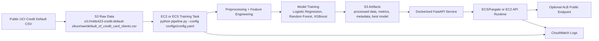

# AWS Architecture Notes

## Purpose

This project implements an AWS-ready machine learning system for credit card default prediction. The design emphasizes MLDS423 Cloud Engineering requirements: cloud storage, repeatable training, artifact management, containerized inference, logging, monitoring, and secure configuration.

Default AWS region for examples: `us-east-2` / US East (Ohio).

## Architecture Diagram



## 1. Raw Data Layer

Raw credit default data is stored in S3 before training.

Example S3 path:

```text
s3://mlds423-credit-default-zikun/raw/default_of_credit_card_clients.csv
```

The code can also run locally with:

```text
data/raw/default_of_credit_card_clients.csv
```

The active path is controlled by `configs/config.yaml` or the `RAW_DATA_URI` environment variable.

## 2. Processing and Training Layer

Training can run on a local machine for development, or on AWS compute for a cloud demonstration.

Recommended AWS options:

- EC2 instance for a simple demo training job.
- ECS task for a more production-like containerized training job.

Training command:

```bash
python pipeline.py --config configs/config.yaml
```

The pipeline:

- loads raw data from local path or S3 URI
- cleans and normalizes notebook-derived raw columns
- adds interpretable behavioral credit-risk features
- uses stratified train/test split
- trains Logistic Regression, Random Forest, and XGBoost when available
- tunes the classification threshold for minority-class F1
- evaluates models with ROC AUC, accuracy, precision, recall, F1, confusion matrix, training time, and inference time

## 3. Artifact Layer

Generated artifacts are saved locally and can be copied/uploaded to S3.

Expected outputs:

- processed dataset: `data/processed/credit_default_processed.csv`
- model artifacts: `artifacts/models/*.joblib`
- best model: `artifacts/best_model.joblib`
- model metadata: `artifacts/best_model_metadata.json`
- metrics summary: `reports/metrics_summary.csv`
- confusion matrices: `reports/confusion_matrices.json`

Cloud layout example:

```text
s3://mlds423-credit-default-zikun/processed/credit_default_processed.csv
s3://mlds423-credit-default-zikun/models/best_model.joblib
s3://mlds423-credit-default-zikun/reports/metrics_summary.csv
s3://mlds423-credit-default-zikun/metadata/best_model_metadata.json
```

## 4. Inference Layer

The inference service is a FastAPI application packaged with Docker.

Local command:

```bash
uvicorn src.api.app:app --host 0.0.0.0 --port 8000
```

Container command:

```bash
docker run --rm -p 8000:8000 mlds423-credit-default-api
```

AWS deployment options:

- ECS/Fargate service running the Docker image.
- EC2 instance running the Docker image.
- Optional Application Load Balancer in front of the ECS service for a public endpoint.

The API exposes:

- `GET /health`
- `POST /predict`

## 5. Logging and Monitoring

The project uses structured JSON logs through `src/logging_utils.py`, which are CloudWatch-compatible when emitted from ECS or EC2.

Recommended CloudWatch signals:

- container startup and model loading success/failure
- `/predict` request count
- prediction latency
- validation errors
- missing artifact errors
- training completion and selected model

CloudWatch alarms can be added later for high 5xx error count, high latency, or task/container failures.

## 6. Security

Security choices:

- No AWS keys or API credentials are hard-coded.
- `.env` is ignored and local only.
- `.env.example` contains placeholders only.
- boto3 uses the default credential chain or IAM roles.
- ECS tasks or EC2 instances should use IAM roles instead of static keys.
- S3 access should follow least privilege.
- Docker image does not copy `.env`, `.aws/`, generated data, or local artifacts.

Recommended least-privilege S3 actions for training/inference roles:

```text
s3:GetObject
s3:PutObject
s3:ListBucket
```

Limit those actions to the project bucket and relevant prefixes.

